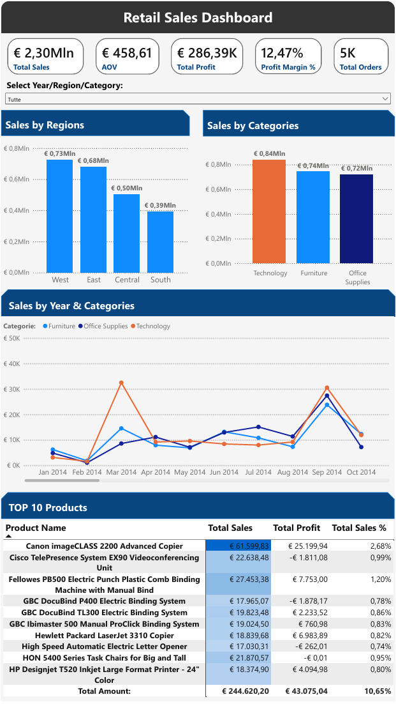
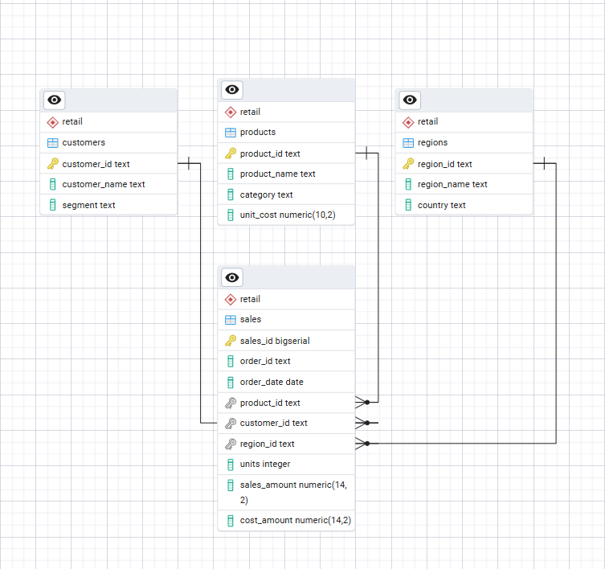
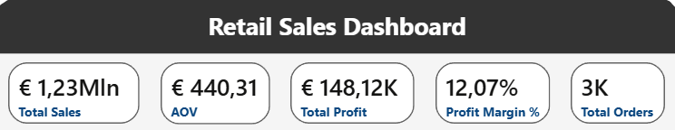
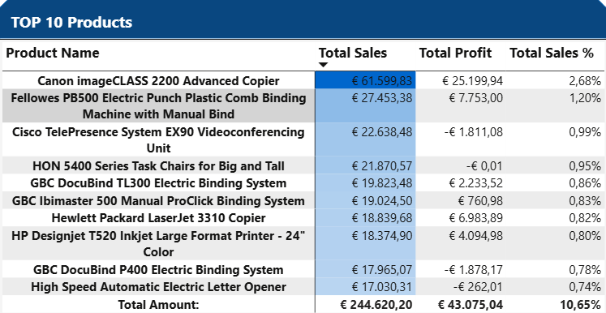

# Retail Sales Analytics – Power BI • PostgreSQL • Excel

Analisi completa delle vendite retail basata sul dataset Superstore, con pipeline end-to-end da Junior Data Analyst:

**Raw Data → PostgreSQL → Data Cleaning → Modello a Stella → Excel → Power BI Dashboard**

Il progetto risponde a domande tipiche di business:

- Quali regioni generano più vendite?
- Quali categorie sono più profittevoli?
- Come variano le vendite mese per mese?
- Quali sono i prodotti più importanti in termini di ricavi?
- Qual è la redditività complessiva (profit margin %)?

---

## Dataset

Il dataset utilizzato proviene da Kaggle:
- Database: **Superstore Dataset**

Download:
- [Superstore Sales – Kaggle](https://www.kaggle.com/datasets/vivek468/superstore-dataset-final)

È stato utilizzato come sorgente principale per la tabella di staging in PostgreSQL.

---

## Tecnologie Utilizzate

| Tecnologia | Utilizzo |
|-----------|----------|
| **PostgreSQL** | Modellazione dati a stella, staging, viste |
| **SQL** | Cleaning, trasformazioni, popolamento dimensioni/fatti |
| **Power Query** | Importazione dati puliti in Excel |
| **Excel** | KPI + Pivot Table |
| **Power BI** | Dashboard interattiva + DAX |
| **DAX** | KPI aziendali, misure e calcoli |

---

## Dashboard Overview



Include:

- KPI Header
- Vendite per Regione
- Vendite per Categoria
- Trend mensile per Categoria
- Top 10 Prodotti

---

## Struttura del progetto

```
retail-sales-project/
│
├─ data-raw/
│ └─ superstore_sales.csv
│
├─ data-processed/
│ └─ RetailSales_v_sales_clean.csv
│
├─ data-docs/
│ └─ dictionary.xlsx
│
├─ excel/
│ └─ RetailSales_Excel.xlsx
│
├─ powerbi/
│ ├─ RetailSales_Dashboard.pbix
│ └─ RetailSales_Dashboard.pdf
│
│
├─ images/
│ ├── dashboard_full.png
│ ├── kpi_header.png
│ ├── top10_products.png
│ ├── db_schema.png
│ │	
│ └─ excel/
│ 	  ├── excel_kpi.png
│ 	  ├── excel_pivot_region.png
│ 	  ├── excel_pivot_time.png
│	  └── excel_pivot_products.png
│
├─ sql/
│ ├─ 01_create_schema.sql
│ ├─ 02_create_tables.sql
│ ├─ 03_create_staging.sql
│ ├─ 04_load_staging.sql
│ ├─ 05_populate_dimensions.sql
│ ├─ 06_populate_sales.sql
│ ├─ 07_create_calendar.sql
│ └─ 08_create_view_v_sales_clean.sql
│
└─ README.md
```

---

## Modello Dati (PostgreSQL)



Il modello è organizzato come **star schema**:

- **sales** → tabella dei fatti  
- **products**, **customers**, **regions**, **calendar** → dimensioni  
- `v_sales_clean` → vista ottimizzata per BI

---

## Pipeline SQL

Scripts in ordine di esecuzione:

`01_create_schema.sql`  
`02_create_tables.sql`  
`03_create_staging.sql`  
`04_load_staging.sql`  
`05_populate_dimensions.sql`  
`06_populate_sales.sql`  
`07_create_calendar.sql`  
`08_create_view_v_sales_clean.sql`  

---

## KPI Principali (Power BI)



Misure calcolate in DAX:

- **Total Sales**
- **Total Profit**
- **Profit Margin %**
- **Total Orders**
- **AOV (Average Order Value)**

---

## Top 10 Products



Top 10 prodotti per ricavi, con percentuale sul totale.

---

## Insight di Business

Dall’analisi emergono diversi aspetti chiave:

- **Technology** è la categoria più performante per ricavi.  
- Il **Profit Margin % complessivo è 12,47%**, buono ma migliorabile.  
- La regione **West** è leader di mercato.  
- **Febbraio, Marzo e Settembre** mostrano i maggiori picchi stagionali.  
- Alcuni prodotti vendono molto ma hanno **profitto negativo** → azione necessaria.  

---

### Come riprodurre il progetto

1. Creare il database PostgreSQL: `retail_project`
2. Eseguire gli script nella cartella /sql nell’ordine indicato
3. Importare il file CSV (UTF-8) nella tabella `staging_superstore`
4. Popolare il modello eseguendo gli script di trasformazione
5. Esportare la vista `v_sales_clean` e caricarla in Excel
6. Aprire il file Power BI e collegarlo al file Excel o direttamente al DB
